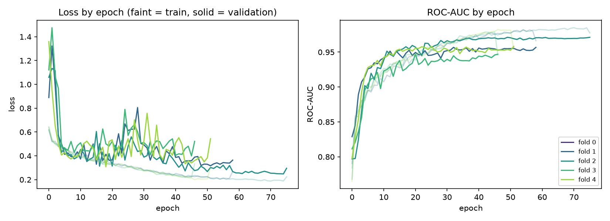
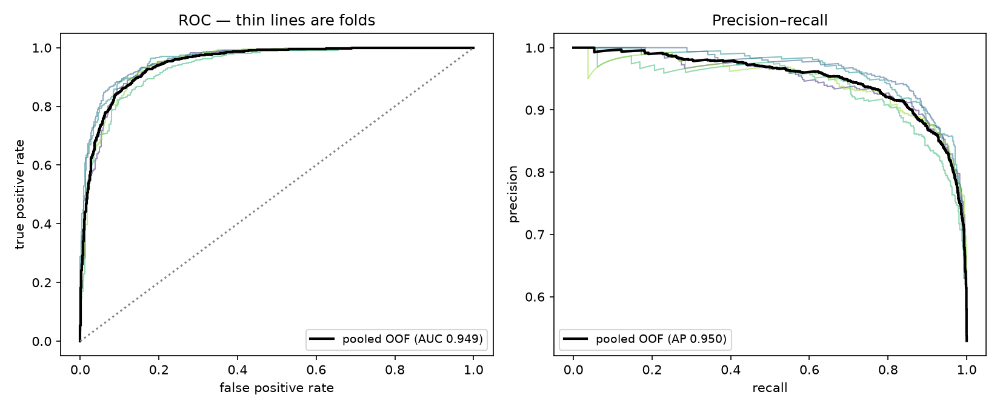
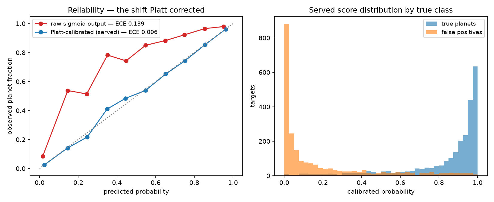
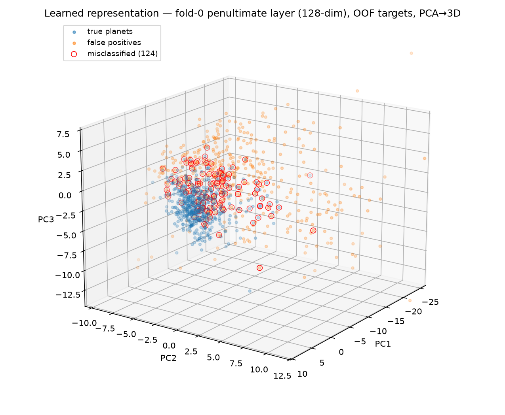

# Exoplanet Hunter V2

Self-refreshing, self-validating, self-serving transit-detection platform:
catalogue refresh → validation gates → tf.data training on an on-demand GPU
burst → calibrated 5-fold ensemble → live FastAPI scoring → interactive
React vetting console. Governing principle: **beat the baseline before you
cheer** — every component must beat the simplest thing that already works,
or it doesn't ship.

Architecture reference: `docs/architecture.md` (the V2 design document).

## Layout

```
pipeline/    ML pipeline package (exoplanet_hunter) + Hydra conf + scripts
api/         FastAPI serving layer — /score/{tic_id}, pinned contract in app/schemas.py
frontend/    React vetting console (Vite + TypeScript)
docker/      api / frontend / GPU-burst-train images  (compose file at root)
orchestration/  Prefect|Dagster DAG            (lands in feat/orchestrator)
infra/       R2 layout, secrets policy, hosting notes
data/        fresh artefacts only — regenerated, DVC-tracked, never committed
```

## Provenance

Seeded by clean-slate extraction from V1 (`main` @ a5faabc plus working-tree
improvements) — the battle-tested science core only:

| Salvaged | Rewritten in V2 (not ported) |
|---|---|
| preprocess: clean / flatten / fold / views | trainer + in-RAM data module → `feat/tfdata-pipeline` |
| models: dual-view CNN (SE + MHA), focal loss, MC-Dropout, RF baseline | Optuna tuning, MLflow utils (rebuilt against tf.data) |
| features: centroid (BEB vetting), handcrafted (RF) | Dash/`viz` dashboard → Streamlit + React console |
| search: BLS / TLS | attention diagnostics (V1 report artefact) |
| training/calibration: temperature scaling (upgraded to Platt scaling post-audit) | registries/paths tied to V1 disk layout |
| eval: metrics, six-panel vetting figure | all preprocessed data artefacts (fresh data only) |
| data: catalogue TAP builder, downloader, stellar params | |
| scripts: build_dataset, preprocess_only, score_target/candidates, render_vetting | |

**No data artefacts were ported.** The first V2 milestone regenerates the
catalogue and views from NASA sources so the new pipeline is validated
end-to-end on data it produced itself.

## Build order (all seven merged — the system is complete and self-running)

1. ✅ `feat/tfdata-pipeline` — tf.data (map→cache→shuffle→batch→prefetch),
   TFRecord shards, mixed precision; rewrite trainer on top.
2. ✅ `feat/validation-gates` — Pandera catalogue checks in CI + the
   beats-current-best promotion gate + leakage guard.
3. ✅ `feat/dvc-versioning` — catalogue + views under DVC, R2 remote.
4. ✅ `feat/fastapi-serving` — refactor `scripts/score_target.py` into the
   `/score/{tic_id}` service (container deploy still pending — Fly.io).
5. ✅ `feat/dashboard` — the React console against the pinned contract;
   reliability diagram (sky map still pending).
6. ✅ `feat/orchestrator` — Prefect DAG with conditional GPU burst.
7. ✅ `feat/data-scaling` — full-pool expansion (5,155 targets: TESS
   uncapped + balanced Kepler block, 9-dim aux with centroid restored).

**Served model** (run `cebb0fe6`, promoted 2026-07-12, recalibrated
2026-07-13): 5-fold CV ROC-AUC **0.951 ± 0.008**, Brier **0.087**, pooled
OOF ECE **0.006** on 4,813 examples (2,448 Kepler + 2,365 TESS).

## Performance

Rendered from the promoted run's artefacts by
`python pipeline/scripts/make_performance_figures.py`; all evaluation is
out-of-fold (each target scored by the one model that never trained on it).

*Per-fold learning curves — five folds converge consistently:*



*Discrimination — ROC and precision–recall, folds + pooled:*



*Calibration — the raw scores were shifted wholesale (red); the served
Platt-calibrated probabilities sit on the diagonal (blue), so "0.9" from
this model means 90%:*



*What the network learned — penultimate-layer activations of out-of-fold
targets, PCA-projected to 3D. Planets and false positives separate cleanly;
the misclassified targets (red rings) live exactly on the class boundary:*



## Quickstart

```bash
conda env create -f environment.yml && conda activate exoplanet-hunter-v2
make test        # salvage smoke tests + API contract tests
python pipeline/scripts/ingest_exofop.py   # build the candidate catalogue
make api         # FastAPI on :8000 (docs at /docs)
make frontend    # console on :5173 (needs: cd frontend && npm install)
```

The console's catalogue page (and `GET /candidates` + `/candidates.csv`)
serves the normalised ExoFOP TOI+CTOI table — see `data/README.md` for the
source exports and rebuild command.
