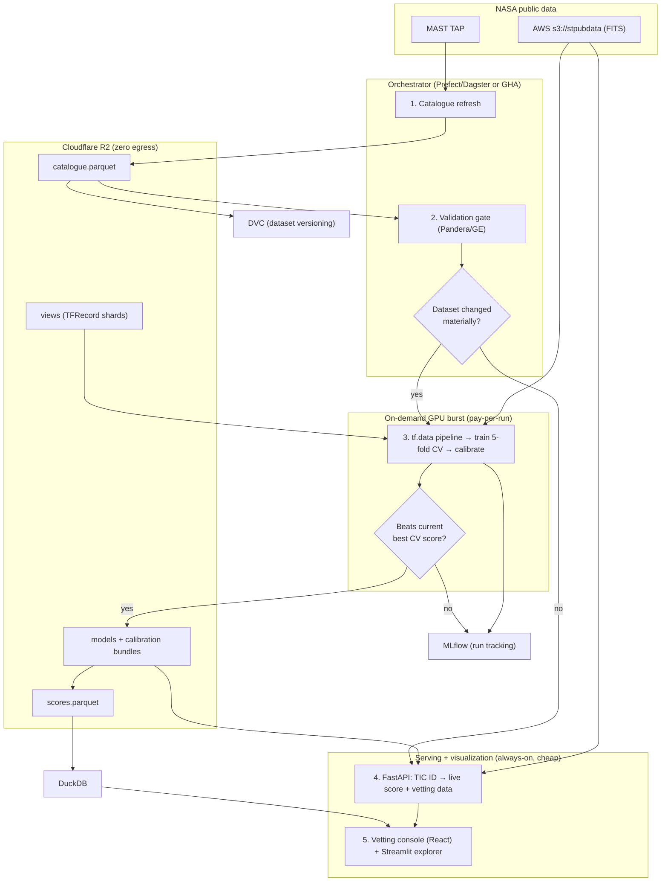

# Exoplanet Hunter V2 — Fully-Automated, Cloud-First Architecture

V1 was about *where things live*: move storage and orchestration off your laptop (DuckDB · Parquet · R2 · GitHub Actions · MLflow · Docker). **V2 is about making the whole thing run itself** — a self-refreshing, self-validating, self-serving system on top of that foundation, with a live inference layer anyone can hit in a browser.

You said breakage is fine and the point is a big upgrade. Agreed — but "big" is measured in capability and defensible choices, not tool count. So this document has one governing principle, and it comes straight out of your own DATA305 sequence-modeling lecture:

> **Beat the baseline before you cheer.** Every component must beat the simplest thing that already works, or it doesn't ship. The lecture's punchline — a SimpleRNN beat a dense linear model by 0.005 °C, "real but weigh against complexity" — is exactly the lens for deciding what goes *into* V2. It's also why Kafka, n8n, and Postman stay *out* (more below).

---

## The V2 picture

---

## "Everything in the cloud, minimal laptop" — the honest version

Storage, orchestration, validation, scoring, the API, and the dashboard are all cloud-hosted and fully automated. There is exactly one piece that costs real money if you naively run it always-on in the cloud: **GPU training.**

The clean resolution — and it keeps "everything cloud + automated" honestly true — is an **on-demand GPU burst**. The orchestrator spins up a GPU *only* when the validation step detects the dataset has changed materially (new confirmed labels, a dataset-expansion run), trains, logs to MLflow → R2, and tears the GPU down. You pay per run, not per month. Your laptop is never in the critical path; it's just one more place you *could* trigger a run from.

So: don't let "put everything in the cloud" quietly commit you to a standing GPU bill. Burst, don't idle.

---

## What's new in V2 (chosen additions — each with why and the trade-off)

**1. Serving layer — a FastAPI inference endpoint.** This is the single highest-impact addition. Paste a TIC ID → the service fetches that target's light curve live from MAST → runs your exact preprocessing → scores with the 5-fold ensemble + MC-Dropout → returns a calibrated probability, an uncertainty band, and the six-panel vetting figure. It turns a static report into a thing people can *use*. Containerized, so it rides directly on the Docker work from V1. *Trade-off:* a free/cheap host may cold-start; fine for a portfolio demo, just note it.

**2. Visualization layer — a vetting console (built; see dedicated section below).** Browser-demoable: sort the priority list by `prob_mean`, `discovery_score`, or period, filter the long-period (P > 500 d) subset, and inspect a candidate's vetting panels — phase folds, the calibrated probability with its uncertainty band, the centroid track against the 3σ BEB threshold, odd/even, and a plain-language verdict. A working React prototype already exists (`exoplanet-vetting-console.jsx`). *Trade-off:* the polished React face is more work than a Streamlit equivalent; the two-tier approach below resolves that.

**3. Validation gates — Pandera or Great Expectations in CI.** Schema and quality checks on the catalogue *before* any training run: column types, disposition-label domains, period/epoch sanity, no all-NaN folds. Given how much your report leans on correctness and calibration, this is the most on-brand MLOps addition you can make. It's also where the governing principle becomes machine-enforced: **a training run that doesn't beat the current best CV score on the same split fails the gate and doesn't get promoted.** *Trade-off:* you have to write and maintain the expectations; worth it.

**4. Dataset versioning — DVC alongside MLflow.** MLflow versions *runs* (params, metrics, model artifacts); DVC versions the *data those runs consumed*. Together they make your stated objective — "every dataset rebuildable, every experiment tracked" — literally true and auditable. *Trade-off:* a second versioning tool to learn; it's lightweight and Git-native.

**5. Orchestrator upgrade — Prefect or Dagster (optional but the real "huge upgrade").** GitHub Actions cron is fine for the lightweight refresh + CI. But the full V2 DAG — refresh → validate → preprocess → *conditionally* train → score → publish, with retries, dependencies, and a run history UI — is what Prefect/Dagster are built for, and they're the genuinely portfolio-relevant data-engineering tools (far more so than n8n). Both self-hostable and free. *Trade-off:* more setup than cron; this is the deliberate complexity you're paying for, and it's justified.

---

## What V2 deliberately leaves out (considered, rejected — and this list is itself a portfolio asset)

- **Apache Kafka.** Kafka is for continuous, high-throughput event *streams*. Your data is batch: catalogues update on a days-to-weeks cadence, light curves are static archival files. There is no stream. Kafka here is a freight train delivering a postcard.
- **n8n.** GitHub Actions / Prefect fit a batch ML DAG; n8n is event-driven SaaS glue. Its only legitimate niche here is a notification ("new high-confidence candidate → Discord/email"), which is a ~10-line webhook inside an existing job, not a platform.
- **Postman.** Your APIs (MAST TAP, NEA, astroquery) are queried from Python, not hand-tested in a GUI. Once V2 exposes its *own* API, FastAPI auto-generates OpenAPI/Swagger docs and pytest + httpx give you automated contract tests — both better than a GUI for something you want fully automated.

Being able to say "I considered these and rejected them, here's why" reads as more senior than having bolted them on.

---

## The visualization layer (prototype built)

The `feat/dashboard` work now has a concrete target: an interactive **candidate vetting console** (`exoplanet-vetting-console.jsx`), built around real branch-4 metadata — TOI-4328.01, the long-period TESS picks, the Kepler KOIs, and the instructive "misses" (the background-EB-suspicious TOI-2886 b, the edge-of-distribution TOI-4773 b). Left pane is the ranked priority list; right pane is the per-candidate vetting view.

**The design thesis: make calibration visible.** The whole point of this project is *trustworthy* probabilities for prioritising scarce follow-up, so the UI spends its one bold element on exactly that. The probability isn't a generic gauge — it's the 5-fold mean shown with its ±MC-dropout band and the five per-fold dots scattered, so a viewer *sees* the uncertainty instead of a single flattened number. That same probability drives a cool→warm colour scale that ties the list and the detail view together, and the centroid readout plots against your real 3σ BEB threshold. Everything else stays quiet so that one idea lands.

**What's real vs. illustrative.** The prototype generates phase-folded light curves from each candidate's parameters so the panels differ and tell the right story. In production those panels render from your actual data: the priority list is a **DuckDB read over `scores.parquet`** in R2, and the per-target vetting panels come from the **FastAPI `/score/{tic_id}` response** (the `score_target` path) rather than being synthesized. That coupling is why the diagram now shows `API → dashboard`: the list is cheap to read from Parquet, but a fresh six-panel view for an arbitrary target needs the live scoring endpoint.

**Framework decision — go two-tier, don't build both at once.** Streamlit (or Gradio) gets you ~80% of this in a fraction of the code by reusing your existing matplotlib six-panel figures directly — that's the right tool for *your own* internal exploration, and it's where to start. The React console is the *public* face: more work, but it's the portfolio-grade showcase and it's the one that makes the project feel like a product. Build the Streamlit explorer first for utility; promote to the React console when you want the demo.

**Two extensions that genuinely add value** (both small, both on-brand):
- A **reliability diagram** (predicted probability vs observed frequency, in bins) — this shows calibration *quality* directly and is the natural visual companion to your Brier-score focus. It's arguably the single most "this person understands calibration" chart you could add.
- A **sky map** of the candidate pool coloured by probability — turns 6,200 rows into a recognisable astronomical view and makes the long-period TESS picks pop spatially.

---

## How your DATA305 material maps onto V2

### L6 Data Pipelines → the scaling backbone

Right now your `views.npz` loads into RAM, which is fine at 3,275 examples. The moment you execute the data-expansion roadmap (per-KOI dedup, asymmetric-transit injection, more TESS sectors), that approach breaks — and L6 is precisely the fix:

- **`tf.data` pipeline:** `map → cache → shuffle → batch → prefetch(AUTOTUNE)`, with `num_parallel_calls=AUTOTUNE`. This replaces feeding NumPy arrays directly to `model.fit` and is what stops the GPU starving while the CPU prepares the next batch.
- **`cache()` placement:** after your deterministic clean/flatten/fold steps, **before** your stochastic augmentation — so the noise (σ=5e-4), phase shifts (±0.5 %), depth scaling (±5 %), and bin masking run fresh each epoch on the cached views, exactly as the lecture prescribes.
- **TFRecord shards** when the processed set outgrows RAM and streams from R2: `TFRecordDataset` + `interleave` + `prefetch` means you never hold 50 GB in memory and the GPU stays fed. This is the lecture's large-dataset story (its rule of thumb: TFRecord past ~10 GB or when disk I/O bottlenecks) and it's the thing that makes "expand the dataset on a rented GPU" actually tractable.
- **Bake aux-feature normalization into the model** (a Keras `Normalization` layer adapted on the training split) rather than shipping the external sklearn scaler. The payoff is for the FastAPI server: the preprocessing travels *inside* the model, so the serving path can't drift from the training path. Your current approach — persisting the fitted sklearn pipeline in the calibration bundle — is already correct; this is an optional simplification that removes a train/serve-skew risk at the serving boundary.
- **Mixed precision** (`mixed_precision.set_global_policy('mixed_float16')`) on the GPU burst: 2–3× speedup on Tensor Cores, which directly cuts your rental cost. Keep your existing gradient clipping and rely on the loss-scaling mixed precision provides — relevant given your documented `loss = NaN` history from unscaled inputs interacting with Adam.
- **The operational tell** from the lecture's quiz: GPU utilisation < 50 % with a healthy loss almost always means a data-pipeline bottleneck, not a model problem → reach for prefetch / cache / parallel map. This matters specifically because in V2 you're paying by the GPU-hour, so an under-fed GPU is wasted money.

### L13 Sequence Modeling → design principles (mostly a validation of what you already do)

- **Baselines-first.** "Beat the baseline before you cheer" — your Random Forest on hand-crafted features is exactly the right instinct, and V2 promotes it from a one-off comparison to a *CI gate*: no model or feature ships unless it beats the current best on the same CV split.
- **Leakage discipline.** The lecture's iron rule ("test set is always later in time") is the time-series cousin of what you already do *more* rigorously: `StratifiedGroupKFold` by `tic_id` (no multi-planet leakage) *and* your since-confirmed temporal holdout (the 120 candidates that flipped PC→confirmed after the catalogue closed). You already exceed the lecture here. V2's job is to *protect* this: the automated catalogue-refresh must never let newly-confirmed labels leak into a set you then evaluate on — that's a validation-gate check.
- **Complexity vs gain.** The lecture's own honest conclusion is the principle governing this entire document. Apply it to every V2 addition, not just the rejected ones.
- **On "should I add a sequence model?"** Honest answer: for your *phase-folded* views, the 1D CNN already captures the relevant structure — phase-folding collapses time-ordering into phase-ordering, which convolutions handle well, so an LSTM/GRU branch is **not** an obvious win and isn't a V2 priority. The genuinely interesting direction the lecture hints at is a sequence/transformer model over the *raw, un-folded* cadences for **period-agnostic single-transit detection** — precisely the TOI-4328.01 (P = 703 d) regime where your report notes BLS lacks the statistical power to flag the candidate at all. That's a compelling *research* branch for a future version, not V2 infrastructure. Flagging it, not scoping it in.

---

## Do you need to upload more course notes?

For the V2 **infrastructure** build: **no.** L6 is the lecture that directly drives it, and you've already given it to me. Don't burn context uploading the rest.

Specifically:
- **Not needed for V2 infra:** L7/L8 (CNN fundamentals/architectures — your model's built), L10–L12 (object detection, segmentation, NLP, LLMs — not your data modality), L14 (LSTM/GRU).
- **Relevant only if you pursue specific *modelling* experiments later:** L9 (transfer learning) maps to a cross-mission Kepler→TESS transfer branch à la ExoMiner++; L14 maps to the speculative raw-cadence sequence model above. Both are post-V2 modelling work, not infrastructure.
- **DATA303 (best-subset selection, wk 8; inference & statistical learning for binary responses, wk 9–12):** these become directly relevant when you do the data-*expansion* feature work — deciding which enriched aux features (planet radius, equilibrium temperature, [Fe/H], odd/even depth, secondary-eclipse depth) actually *earn their place* in the vector rather than just inflating it. That's best-subset / model-selection territory, and binary-response inference underpins how you reason about the calibrated classifier. **Upload those two when you reach the feature-expansion phase, not now.**

---

## Suggested V2 build order (extends V1's `feat/` sequence)

V1 branches first (Docker → R2 → DuckDB → MLflow-on-R2 → GHA refresh), then:

1. `feat/tfdata-pipeline` — convert training input to `tf.data` (cache/prefetch/parallel-map), shard views to TFRecord for streaming from R2; add mixed precision to the training config.
2. `feat/validation-gates` — Pandera/GE catalogue checks in CI + the "beats current best CV" promotion gate.
3. `feat/dvc-versioning` — bring the catalogue and processed views under DVC.
4. `feat/fastapi-serving` — the TIC-ID inference endpoint, containerized; deploy.
5. `feat/dashboard` — visualization layer: Streamlit explorer first (reuses your matplotlib six-panel figures), then the React vetting console (`exoplanet-vetting-console.jsx`) as the public showcase. Reads the list from DuckDB/`scores.parquet`; pulls per-target panels from the FastAPI endpoint (branch 4).
6. `feat/orchestrator` — Prefect/Dagster DAG with the conditional on-demand GPU-burst training step.
7. `feat/data-scaling` — the actual dataset expansion (now safe to run, because 1–6 make it automated and validated).

Each branch leaves a working `main`, so you're never mid-rewrite with everything broken — which matters even when "breakage is fine," because it keeps the breakage *localized and reworkable* rather than total.

---

## Verify before committing

- **Free-tier limits shift** — confirm current terms for your serving host (Hugging Face Spaces / Fly.io / Render), R2, and GitHub Actions before you build on them.
- **Serving cold-starts** — a free always-warm tier may sleep; acceptable for a demo, but decide whether you want a cheap always-on instance for the API.
- **Credentials** — R2 keys, any DB URLs, host tokens go in GitHub Secrets / the host's secret store, never in the repo or a committed Hydra config.
- **GPU-burst trigger logic** — define "dataset changed materially" precisely (e.g. N new confirmed labels, or an explicit expansion tag) so the orchestrator doesn't fire expensive runs on trivial refreshes.
- **Dashboard ↔ serving contract** — pin the JSON shape the FastAPI `/score/{tic_id}` endpoint returns (probability, σ, per-fold values, centroid SNR, odd/even, the binned global/local arrays) before wiring the React console to it, so the front-end and the endpoint evolve together rather than drifting.
