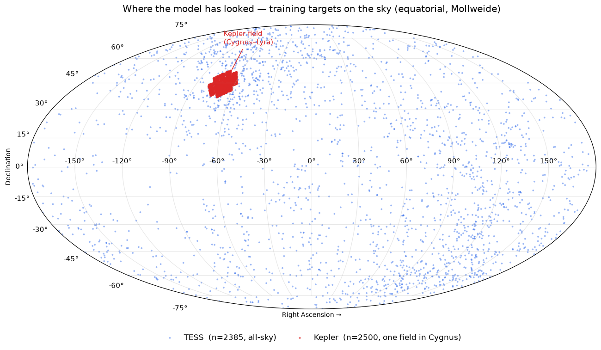
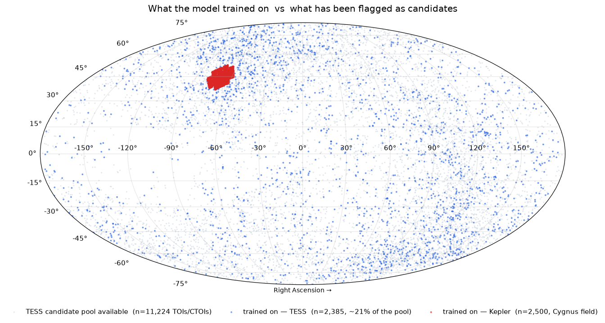
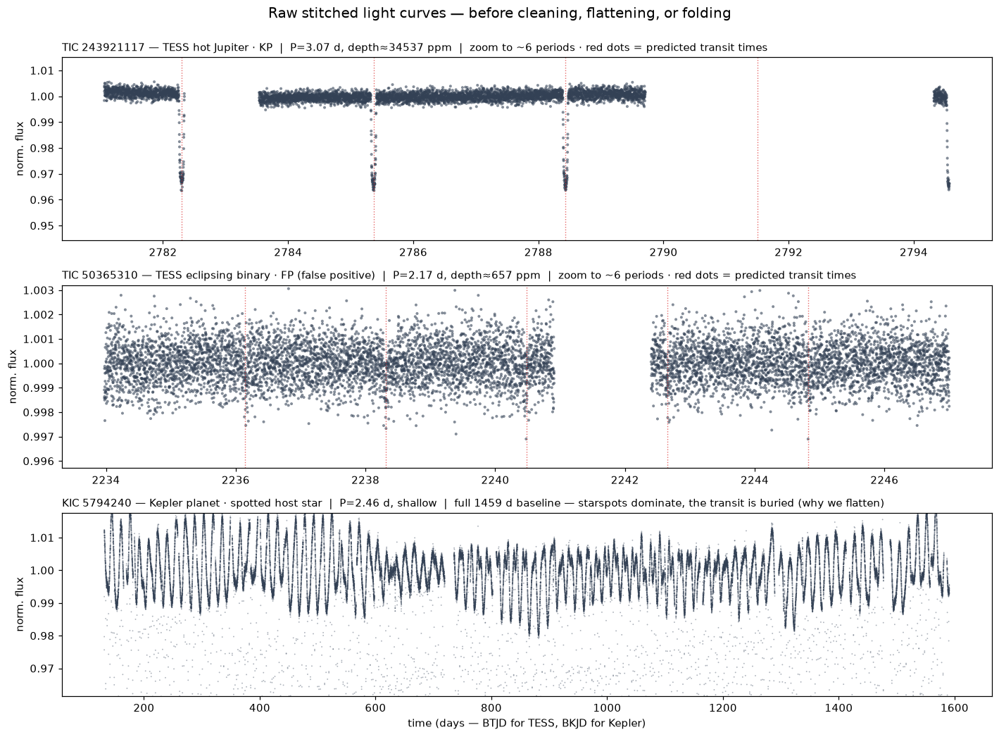

# Data provenance — where our data comes from and where the model has looked

This note documents the *origins* of the data behind Exoplanet Hunter V2: the
authoritative catalogues we pull labels from, the archives the raw light
curves come from, and — visually — which patch of sky the served model has
actually been trained on versus everything that has been observed. It exists
because "where did the training distribution come from?" is a first-order
question for interpreting anything the model says.

All figures are regenerated from the live artefacts; the sky positions are
read straight from the `RA_OBJ`/`DEC_OBJ` keywords in each target's FITS
header (4,885 of the 5,156 training targets resolved).

## Sources of truth

The **NASA Exoplanet Archive** (`exoplanetarchive.ipac.caltech.edu`) is the
source of truth for *labels*, queried over its TAP service
(`/TAP/sync`) in `data/catalog.py`:

| Table (TAP) | What it gives us | Used for |
|---|---|---|
| `ps` (Planetary Systems) | TESS-discovered **confirmed planets** (`disc_facility like '%TESS%'`) | positive labels |
| `toi` (TESS Project Candidates) | every TOI with its **TFOPWG disposition** (`tfopwg_disp`: CP/KP/FP/PC) | pos / neg / held-out |
| `cumulative` (Kepler Objects of Interest) | KOIs with `koi_disposition` (CONFIRMED / FALSE POSITIVE / CANDIDATE) | Kepler pos / neg |

**ExoFOP** (`exofop.ipac.caltech.edu/tess`) is a *secondary, enrichment*
source, not the label authority (`data/exofop.py`): the TOI + **CTOI** CSVs
(community candidates not in the archive's `toi` table) populate the console's
candidate catalogue, and supply the transit-SNR column joined onto TESS rows.

Raw light curves come from the mission archives, not either catalogue:

- **TESS** — SPOC 2-minute light curves from **MAST** (via `lightkurve`).
- **Kepler** — long-cadence light curves pulled **directly from the STScI
  archive** (`archive.stsci.edu/pub/kepler/lightcurves`), with a MAST search
  fallback (`data/download.py`).

So the common shorthand "we only look at ExoFOP" is inverted: the labels are
already anchored to the NASA Exoplanet Archive; ExoFOP only adds CTOIs and
follow-up columns on top.

## Where the model has looked

The training set is two completely different observing strategies:

- **Kepler (red, n=2,500)** — one fixed ~115 deg² field in **Cygnus–Lyra**,
  RA 280–302°, Dec +37–52°, centroid **(291.9°, +43.8°)**. Kepler stared here
  continuously 2009–2013, which is why its targets have ~4-year baselines but
  cover only this keyhole.
- **TESS (blue, n=2,385)** — **all-sky**, Dec −89° to +88°, every RA, from
  TESS's 27-day sector tiling.

## What we trained on vs what has been observed

The coloured points (what the model learned from) sit inside a much larger
grey cloud (the **11,224** TOIs/CTOIs currently flagged as candidates). On the
TESS side we trained on ~21% of that flagged pool. And the flagged pool is
itself a vanishingly small, **disposition-selected** slice of the ~2×10⁸ stars
TESS has actually observed — targets only enter our training set once a human
or pipeline has already dispositioned them. This is the key caveat for any
data-science reading of the model: the training distribution is *dispositioned
transit candidates*, not a random sample of observed stars, so selection
effects (bright-star bias, short-period bias, the confirmed/FP class balance)
are baked in.

Counts (this build): 5,156 labelled targets — **2,656 TESS + 2,500 Kepler**,
roughly balanced planet-ish (2,565) vs false-positive (2,320). On disk the raw
FITS cache is 2,391 TESS files (39 GB) + 4,542 Kepler files (42 GB).

## What the raw data actually looks like

Three targets straight off disk — stitched multi-sector flux, before any
cleaning, flattening, or phase-folding:

1. **Hot Jupiter (TIC 243921117, ~34,500 ppm)** — the easy case: 3.5%-deep
   box transits land exactly on the predicted times (red). Visible by eye.
2. **Eclipsing-binary false positive (TIC 50365310, ~657 ppm on-target)** —
   the real eclipse is on a blended background star, so the on-target dip is
   shallow and noisy; this is why the centroid + duration cautions catch it,
   not the transit shape.
3. **Kepler planet on a spotted star (KIC 5794240)** — ~2% quasi-periodic
   starspot variability swamps the transit entirely over the 1,459-day
   baseline. This is exactly why the pipeline flattens/detrends before the
   model ever sees the signal.

## Archive tables we do *not* yet exploit (opportunities)

The NASA Exoplanet Archive offers more than the three tables we query. Worth
considering in a future data pass (not yet implemented):

- **K2 planets & candidates** (`k2pandc`) — a whole mission of labelled
  transits along the ecliptic that we currently ignore.
- **Kepler Certified False Positives** (`fpwg`) and **KOI False-Positive
  Probabilities** (`koifpp`) — higher-quality / vetted negative labels than
  the bare `koi_disposition`.
- **PSCompPars** (composite parameters) — a cleaner one-row-per-planet merge
  of stellar/planet parameters than the default-flag `ps` rows.
- **POE (Predicted Observables for Exoplanets)** equations — the archive's
  authoritative formulae for insolation, habitable-zone radii, RV/astrometric
  semi-amplitude, and transit depth. Overlaps our `features/followup.py`
  (TSM/ESM/predicted mass/RV) and would let us add insolation and HZ columns
  and cross-check the ones we compute.
