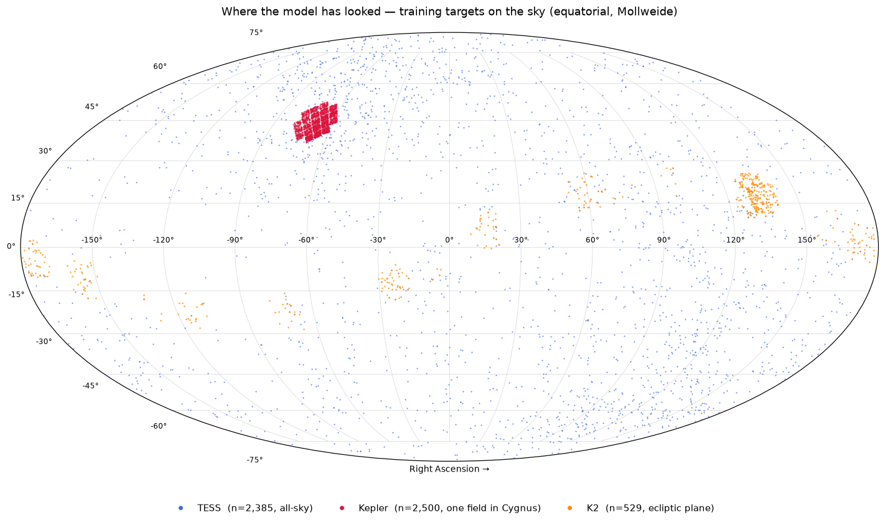
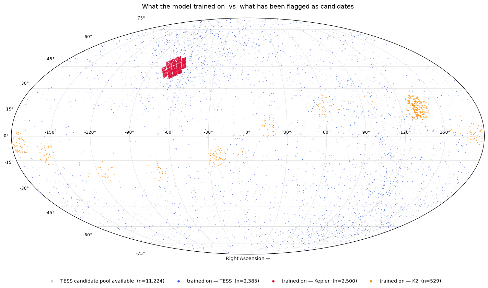
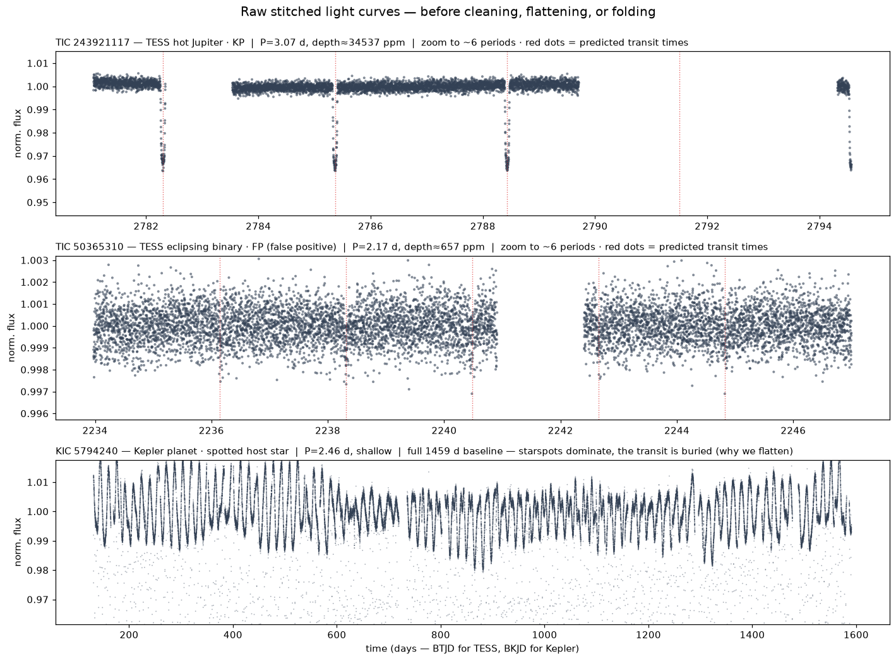

# Data Provenance

Where the data comes from, where the model has looked, and the measured
findings that describe both. "Where did the training distribution come from?"
is a first-order question for interpreting anything the model says, and §6 is
the ledger of every headline number this project has measured against it.

All figures are regenerated from the live artefacts by
`pipeline/scripts/plot_provenance.py`; sky positions are read from the
`RA_OBJ`/`DEC_OBJ` keywords in each target's FITS header (5,414 of the 5,686
training targets resolved).

## Sources of truth

The **NASA Exoplanet Archive** (`exoplanetarchive.ipac.caltech.edu`) is the
source of truth for *labels*, queried over its TAP service
(`/TAP/sync`) in `data/catalog.py`:

| Table (TAP) | What it gives us | Used for |
|---|---|---|
| `ps` (Planetary Systems) | TESS-discovered **confirmed planets** (`disc_facility like '%TESS%'`) | positive labels |
| `toi` (TESS Project Candidates) | every TOI with its **TFOPWG disposition** (`tfopwg_disp`: CP/KP/FP/PC) | pos / neg / held-out |
| `cumulative` (Kepler Objects of Interest) | KOIs with `koi_disposition` (CONFIRMED / FALSE POSITIVE / CANDIDATE) | Kepler pos / neg |
| `q1_q17_dr25_koi` (Kepler DR25 KOI) | `koi_score` — the Robovetter vote behind the retired certified-FP table | certifying Kepler negatives |
| `k2pandc` (K2 Planets & Candidates) | EPIC-keyed dispositions (CONFIRMED / FALSE POSITIVE / REFUTED / CANDIDATE) | K2 pos / neg / held-out |

**ExoFOP** (`exofop.ipac.caltech.edu/tess`) is a *secondary, enrichment*
source, not the label authority (`data/csv/exofop.py`): the TOI + **CTOI** CSVs
(community candidates not in the archive's `toi` table) populate the console's
candidate catalogue, and supply the transit-SNR column joined onto TESS rows.

Raw light curves come from the mission archives, not either catalogue:

- **TESS** — SPOC 2-minute light curves from **MAST** (via `lightkurve`).
- **Kepler** — long-cadence light curves pulled **directly from the STScI
  archive** (`archive.stsci.edu/pub/kepler/lightcurves`), with a MAST search
  fallback (`data/download.py`).
- **K2** — EPIC-indexed campaign light curves from **MAST** (via `lightkurve`,
  author `K2`), cached alongside TESS in `data/raw/tess/lightcurves` as `epic_*.fits`.

So the common shorthand "we only look at ExoFOP" is inverted: the labels are
already anchored to the NASA Exoplanet Archive; ExoFOP only adds CTOIs and
follow-up columns on top.

## Where the model has looked

The training set is three completely different observing strategies:

- **Kepler (red, n=2,500)** — one fixed ~115 deg² field in **Cygnus–Lyra**,
  RA 280–302°, Dec +37–52°, centroid **(291.9°, +43.8°)**. Kepler stared here
  continuously 2009–2013, which is why its targets have ~4-year baselines but
  cover only this keyhole.
- **TESS (blue, n=2,385)** — **all-sky**, Dec −89° to +88°, every RA, from
  TESS's 27-day sector tiling.
- **K2 (orange, n=529)** — the **ecliptic plane**, in discrete clumps: after
  losing a second reaction wheel Kepler could only hold pointing along the
  ecliptic, observing a chain of ~80-day campaign fields. Those campaigns are
  the orange islands strung across the map, all within roughly ±30° of the
  ecliptic — a footprint neither of the other two missions covers well.

## What we trained on vs what has been observed

The coloured points (what the model learned from) sit inside a much larger
grey cloud (the **11,224** TOIs/CTOIs currently flagged as candidates). On the
TESS side we trained on ~21% of that flagged pool. And the flagged pool is
itself a vanishingly small, **disposition-selected** slice of the ~2×10⁸ stars
TESS has actually observed — targets only enter our training set once a human
or pipeline has already dispositioned them. This is the key caveat for any
data-science reading of the model: the training distribution is *dispositioned
transit candidates*, not a random sample of observed stars, so selection
effects (bright-star bias, short-period bias, the confirmed/FP class balance)
are baked in.

Counts (this build): 5,686 labelled targets — **2,656 TESS + 2,500 Kepler +
530 K2**. On disk the raw FITS cache is 2,391 TESS + 529 K2 files in
`data/raw/tess/lightcurves`, plus 4,705 Kepler files in `data/raw/kepler/lightcurves`.

The grey pool is TESS-only (TOIs/CTOIs from ExoFOP), so the Kepler and K2
points sit outside it by construction — their held-out candidate pools live in
`data/tables/labels/candidates.parquet` instead (1,630 Kepler + 834 K2).

## What the raw data actually looks like

Three targets straight off disk — stitched multi-sector flux, before any
cleaning, flattening, or phase-folding:

1. **Hot Jupiter (TIC 243921117, ~34,500 ppm)** — the easy case: 3.5%-deep
   box transits land exactly on the predicted times (red). Visible by eye.
2. **Eclipsing-binary false positive (TIC 50365310, ~657 ppm on-target)** —
   the real eclipse is on a blended background star, so the on-target dip is
   shallow and noisy; this is why the centroid + duration cautions catch it,
   not the transit shape.
3. **Kepler planet on a spotted star (KIC 5794240)** — ~2% quasi-periodic
   starspot variability swamps the transit entirely over the 1,459-day
   baseline. This is exactly why the pipeline flattens/detrends before the
   model ever sees the signal.

## Archive tables we do *not* yet exploit (opportunities)

The NASA Exoplanet Archive offers more than the tables we query. Worth
considering in a future data pass (not yet implemented):

- **PSCompPars** (composite parameters) — a cleaner one-row-per-planet merge
  of stellar/planet parameters than the default-flag `ps` rows.

Now implemented (kept here for provenance):

- **K2 planets & candidates** (`k2pandc`) — DONE (Step 2c). `data/catalog.py::
  _query_k2` adds the K2 mission (ecliptic-plane coverage — a third sky band):
  EPIC-keyed dispositions (CONFIRMED→1, FALSE POSITIVE/REFUTED→0, CANDIDATE
  held out), stored in `tic_id` with `mission="K2"` and downloaded EPIC-indexed
  via lightkurve (`download.py` K2 config). The archive's `default_flag=1` set
  often omits the transit ephemeris (RV-confirmed planets), so we instead
  require period+epoch+duration and prefer the default row when it has them —
  recovering ~315 CONFIRMED + ~215 FP/REFUTED + ~834 held-out candidates. Depth
  is percent (÷100, verified against (Rp/R*)²); stellar params come inline.
- **Cleaner Kepler negatives** — DONE (Step 2b). The **Kepler Certified False
  Positives** (`fpwg`) and **KOI False-Positive Probabilities** (`koifpp`)
  tables are no longer served by the archive (neither via TAP nor the retired
  legacy API), so `data/catalog.py::_query_certified_fp` reconstructs the
  certification from the DR25 KOI table (`q1_q17_dr25_koi`): Kepler training
  negatives are restricted to KOIs DR25 dispositions FALSE POSITIVE with
  `koi_score < 0.5` (a majority false-positive Robovetter vote) — the same
  evidence the certification rested on, TAP-native. ~79% of the bare
  `cumulative` FPs certify; the rest are dropped as DR25-disputed or unvetted.
- **POE (Predicted Observables for Exoplanets)** — DONE (Step 2a). Insolation +
  habitable-zone columns computed in `features/followup.py` from the archive's
  formulae (`stellar_luminosity_lsun` / `insolation_flux_earth` /
  `habitable_zone_au`) and cross-checked against our own Teq recipe.

## Measured findings — the metrics ledger

Every headline number the project has measured, with the artefact it came from
and where its full reading is recorded. **This table is the index; the
narrative, the pre-registration each result was read against, and the
qualifications all live in [roadmap.md](roadmap.md).** Nothing enters here that
was not measured from an artefact in this repository.

Two conventions carry through all of it. A margin is reported against the noise
floor measured **in the same run**, by the rule `2 x sd / sqrt(n_models_per_fold)`.
And a number that landed outside the terms fixed before it was run is recorded
as falsified rather than re-specified.

### Served model

| Metric | Value | Source |
|---|---|---|
| Run | `ca906040`, serving since 2026-07-19 | `models/registry.json` |
| CV ROC-AUC | 0.9581 ± 0.0057 | `cv_summary.json` |
| Brier | 0.0791 | `cv_summary.json` |
| ECE | 0.0276; pooled out-of-fold 0.0129 | `cv_summary.json` |
| TESS recall @1% FPR | 0.3069 | out-of-fold predictions |
| Injection–recovery | 50% complete at S/N ≈ 15, 90% at S/N ≈ 44 | injection-recovery run |

Mission separation matters and is not cosmetic: TESS AUC trails Kepler by
several points, and a pooled figure hides it.

### Observation-baseline dependence

The model reads how long a target was observed, not only how much transit
evidence was collected. Measured on the TESS out-of-fold slice, n = 2,399.

| Quantity | Value | Recorded in |
|---|---|---|
| Spearman(score, baseline) — branch, before intervention | +0.5155 | roadmap 3.9a |
| Spearman(label, baseline) — the labels' own bias | +0.3874 | roadmap 3.9a |
| Amplification gap (score − label) | +0.1281 | roadmap 3.9a |
| Gap after propensity weighting | **−0.0071**, a −0.1336 move at 3.3x its bar | roadmap 3.9b |
| Cost of that fix in AUC / recall | level on both (0.8x, 0.3x) | roadmap 3.9b |

Propensity weighting removed the architecture's *amplification* of the confound
at no measurable cost. The bias **in the labels** is untouched and cannot be
reached this way — it is +0.3874 by definition on a frozen evaluation slice.

### Host scoring — the control arm

Synthetic transit-free light curves at real host positions. A model that scores
these is reading the star, not the transit. 580 baseline-matched hosts,
290 planet / 290 false-positive.

| Lane | Planet-minus-FP split | Host-AUC (threshold-free) |
|---|---|---|
| Stage 7i rebaseline | +0.1195 | 0.5876 |
| Stage 8 control | +0.1690 | 0.6234 |
| Stage 8 propensity | +0.0724 | 0.6045 |

The split fell by −0.0966 (1.3x its pre-registered bar) but the threshold-free
host-AUC did not move (−0.0190, CI crossing zero). **The pre-registered
statistic moved and the construct behind it did not**, so the second win is
recorded as qualified and is not banked until a threshold-free measurement
confirms it. Full reading in roadmap 3.9c.

Reseeding alone moved the control's split by +0.0494 — half the effect being
claimed. Running a same-code control arm was load-bearing.

### Ensembling — stage 10.5

Dual-view and branch models on a pinned common fold assignment, 5,375 shared
targets, n = 2,367 on the TESS gate slice.

| Model | TESS AUC | Recall @1% FPR |
|---|---|---|
| Dual-view, common folds — the bar | 0.9187 | 0.3046 |
| Branch, un-weighted | 0.9250 | 0.2831 |
| Branch, propensity-weighted | 0.9165 | 0.2000 |
| **Ensemble E-C** (mean of logits) | 0.9549 | **0.4362** |
| **Ensemble E-P** (mean of logits) | 0.9527 | **0.4223** |

Margins of +0.1315 and +0.1177 against floors of 0.0407 and 0.0469 — **3.2x and
2.5x**, and 2.5x / 1.7x against the conservative bound. Both clear.

**The branch line's value is as a complement, not a replacement.** This reopens
nothing about the architecture rejections, which were about replacement.

Two qualifications travel with it. The originally reported 3.9x / 4.1x rested on
an un-pre-registered pairing that minimised the floor and are **falsified in
their stated form** (roadmap 3.11d). And E-P's ensemble baseline sensitivity is
+0.4240, **above both its members** (+0.3880, +0.3956) — averaging created
baseline dependence rather than inheriting it. Unexplained.

### Host scoring by architecture — the control arm, 2026-08-15

Measured on the identical 580 transit-free hosts. **Host-AUC here is a defect
measure: higher is worse.** A model that separates planet hosts from FP hosts on
a light curve with no transit in it is reading the star.

| Architecture | Run | Host-AUC | Paired d vs dual-view | 95% CI |
|---|---|---:|---:|---|
| dual-view | stage 10.5 common folds | **0.7102** | — | — |
| dual-view | incumbent `ca906040` | **0.7123** | −0.0020 | [−0.020, +0.018] crosses |
| branch | E-C, un-weighted | 0.6184 | +0.0919 | [+0.029, +0.153] **excludes** |
| branch | E-P, propensity | 0.5626 | +0.1477 | [+0.086, +0.215] **excludes** |

**The served architecture is the more host-scoring one.** Two independently
trained dual-view runs, on different folds over different populations, land
0.0020 apart, so ~0.71 is a property of the architecture rather than of a run.
Every earlier control-arm measurement in this project was a branch model at
0.56–0.62, which is where the "~0.60" in the record comes from.

Ensembling does not move it: E-C +0.0236 [−0.008, +0.055], E-P −0.0174 [−0.052,
+0.016], both crossing zero. Full reading in roadmap 3.11e.

### Why the control-arm split is not trusted

| Run | Architecture | Split | Host-AUC |
|---|---|---:|---:|
| incumbent `ca906040` | dual-view | **+0.1218** | 0.7123 |
| stage 10.5 dual-view | dual-view | **+0.2713** | 0.7102 |

Same architecture, same hosts, **0.0020 apart** on the threshold-free construct
and **0.1495 apart** on the split — more than the entire effect stage 8 reported
on this statistic. The split is thresholded and moves with operating-point
placement independently of what it stands for. Read the host-AUC beside it, or
instead.

This is why stage 8's second win stays **qualified and unbanked**.

### Standing caveat on the noise floors

The floors are estimated from three draws and are recorded four times now as too
thin for the decisions they carry. Measured `gate_recall_seed_sd` came in at
roughly double the earlier stage-6 figure (0.0677 and 0.0935 against 0.0337), and
with three members the ensemble floor moves by up to 2.4x depending on an
arbitrary pairing. Conclusions to date survive the wider floors; the next result
to lean on this quantity should widen them first.

### Data Validation coverage

Measured over the built DV scalars table: 6,484 rows across 5,766 targets, 0
parse failures.

| Quantity | Value |
|---|---|
| `dv_usable` true | 92.9% |
| Rows where the best-matching TCE is a **different signal** | 452 (7.0%) |
| Rows unverifiable (no catalogue period) | 8 |
| Median observed/expected transit ratio | **0.29** |
| Reports catching every predicted transit | **12%** |

The 452 mismatched rows must be masked, not trained on: attaching another
signal's bootstrap FAP, ghost statistic and transit counts to our candidate is
invisible to everything downstream.

The 0.29 median is the completeness thesis in one number. **Two targets with
identical folded views can differ by a factor of three in how much real transit
evidence they contain** — invisible in a fold, which is precisely what the
unfolded view exists to expose.

### Gaia astrometry coverage

| Quantity | Value |
|---|---|
| Targets with a Gaia counterpart | 7,177 / 7,204 (99.6%) |
| Targets with RUWE | 7,071 (98.5%) |
| Median RUWE | 1.028 |
| Above the 1.4 unresolved-binary cut | 1,166 (16.5%) |
| Targets with more than one DR3 candidate | 499 (7.0%) |

Two hops are required because the catalogues do not line up: TIC v8 carries a
Gaia **DR2** source id and `ruwe` is a **DR3** column, so the join routes through
`gaiadr3.dr2_neighbourhood`. That table is many-to-many — 7.0% of targets have
more than one DR3 candidate, meaning DR3 resolved a blend DR2 saw as a single
source. The nearest match is kept and `n_dr3_candidates` recorded; taking an
arbitrary row would attach a *neighbour's* RUWE to the target.

Coverage is **0% on Kepler and K2**. That is recorded as absent rather than
imputed as zero, because a missing branch otherwise poisons every row of its
mission.

### The bug that passed every gate

Kept because it is the strongest argument in the project for verifying by
executing rather than by reading a green run.

The DV scalars table publishes its **own** observed/expected transit counts. The
side-table merge left both unrenamed, so pandas suffixed ours *and* theirs to
`_x`/`_y`, and the shard writer's `if c in scalars.columns` filter then wrote
**13 scalars instead of 15 without a word**.

The two columns lost were `observed_transit_count` and `expected_transit_count`
— exactly the pair the unfolded branch exists to provide, and the pair that
stage's success criterion was to be measured on. The build succeeded, all seven
gates passed, and the shards were wrong. It was caught only by counting the
scalars in `metadata.json` against `FEATURE_COLUMNS`.

### Null and negative results

Recorded because they constrain what the model is, and because a project that
only records its wins cannot be trusted about them.

| Result | Outcome |
|---|---|
| 13-dim vetting-feature retrain | ΔAUC −1.3×10⁻⁵ — a flat null. Rejected, not rationalised |
| Per-diagnostic branch architecture, as a *replacement* | rejected across three runs and a capacity arm |
| Capacity as the explanation for that | falsified — +19% params, paired d = −0.44 |
| Synthetic negatives against baseline dependence | moved the gap least of any arm (0.1x) |
| Stratified negatives | structurally unreadable — dropped rows leave the evaluation population incomplete |

A resampling intervention has to keep the evaluation population whole even when
it changes the training one. That lesson stands in place of the re-run.
