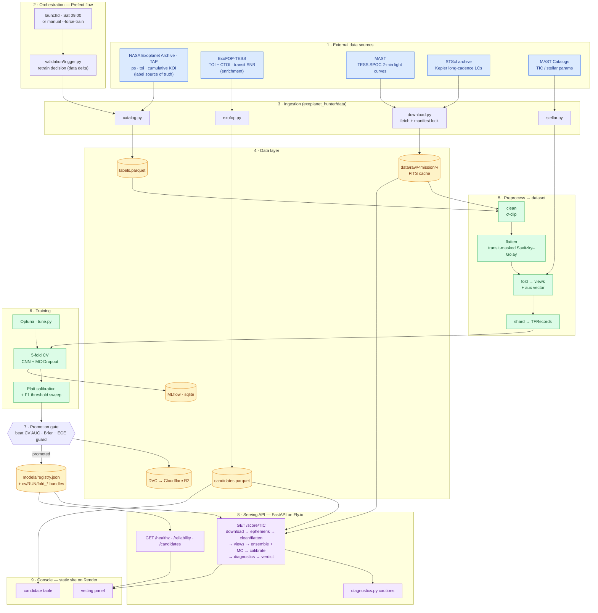

# Model Pipeline

The end-to-end path: from the catalogues and mission archives, through the
self-refreshing training pipeline and the promotion gate, to the live scoring API
and vetting console.

The training path is a genuine sequence — ingest, preprocess, train, gate, serve.
The Prefect flow wraps it, and the weekly trigger closes the loop.

Blue: external sources. Amber: data and storage. Green: compute. Purple:
serving.

## 1. Catalogue refresh

Labels are pulled from the NASA Exoplanet Archive over its TAP service:
confirmed planets and false positives from TESS, Kepler and K2, plus the
unvetted candidate list from ExoFOP. Kepler negatives are restricted to
DR25-certified false positives, so the negative class is genuinely certain
rather than merely unconfirmed.

Sources, tables and their exact roles are in
[data_provenance.md](data_provenance.md).

## 2. Validation gates

Seven gates run before anything trains, named as `validate_data.py` reports
them. Only the first two are Pandera schemas; the rest are structural checks and
guards:

- `label-catalogue` and `candidate-catalogue` — Pandera schema validation
- `views` and `view-set` — structural checks on the processed arrays
- `dv-archive` — completeness against the TESS targets the catalogue knows
  about, so an interrupted fetch reads as "never queried" rather than "no DV
  products for this target"
- `label-shrink` — fails the run if the catalogue loses more than 10% of its
  rows, or drops a mission entirely
- `refresh-leakage` — quarantines label flips into a prospective holdout

The last two compare against the previous catalogue, so they run only when
`--previous-labels` is passed. CI passes it, so all seven run there.

The shrink guard exists because a bug once silently rewrote the catalogue from
5,686 rows to 1,000.

## 3. Preprocessing

The light curve is downloaded, sigma-clipped, then flattened with a
Savitzky-Golay filter **with the transit masked out**, so detrending cannot eat
the signal it is meant to preserve. It is then phase-folded at the known
ephemeris into the views listed in [model_specs.md](model_specs.md), and an
auxiliary vector of stellar and ephemeris parameters is attached.

Views are sharded to TFRecords. Scalar normalisation lives inside the shard
pipeline, so a shard round-trip is the only faithful way to reproduce a branch
model's inputs.

## 4. Training

5-fold cross-validation, grouped so that no target appears in two folds.
MC-Dropout for uncertainty, then Platt scaling for calibration.

Where a run trains multiple members per fold, members are averaged and the
calibrator is fitted once over the average. See
[model_specs.md](model_specs.md) §2.3.

The outer split can be pinned from a file so that two different trainers
partition an overlapping population identically. Without it, models built on
different shard sets cannot be ensembled or compared, because each constructs
its own split over its own population and no shared seed makes them agree.

## 5. Promotion gate

A new run becomes the served model only if it beats the champion's
cross-validated ROC-AUC without degrading Brier score or calibration error.

The gate has rejected multiple retrains. That is the gate working.

## 6. Serving

FastAPI on Fly.io, scale-to-zero. `GET /score/{tic_id}` fetches the light curve,
resolves an ephemeris (user-supplied, then catalogue, then BLS), runs the full
preprocessing path and the ensemble, and returns a calibrated probability with
the diagnostic panels. The console renders it for human vetting.

Response fields are documented in [overview.md](overview.md) §4.

## 7. Automation

A weekly job refreshes the catalogue, runs the gates, retrains only if the data
changed materially, runs the promotion gate, and versions every artefact to
Cloudflare R2 through DVC.
