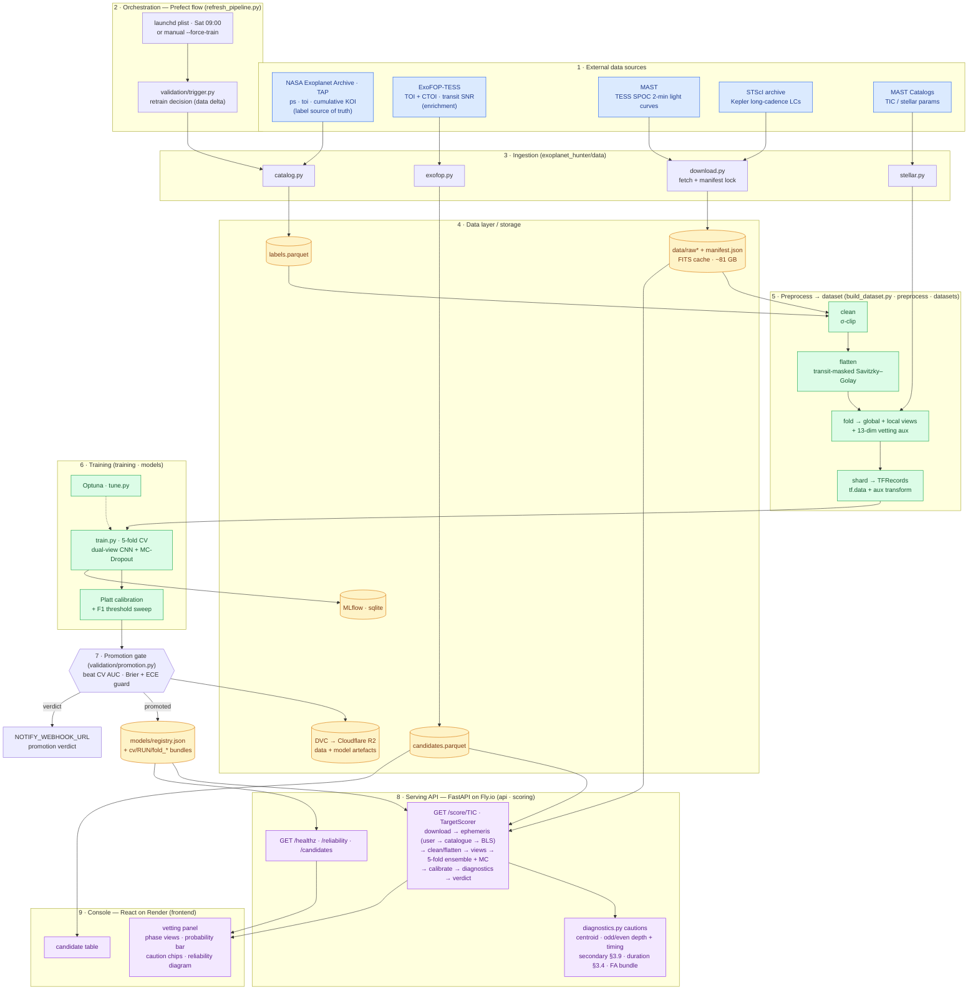

# System architecture — orchestration, pipeline, model, serving

End-to-end map of Exoplanet Hunter V2: from the catalogues and mission
archives, through the self-refreshing training pipeline and promotion gate,
to the live scoring API and vetting console. The training path is a genuine
sequence (ingest → preprocess → train → gate → serve); the Prefect flow wraps
it and the weekly trigger closes the loop.

**Legend** — blue: external sources · amber: data/storage · green:
compute (preprocess + train) · purple: serving (API + console).

**Reading it.** The weekly `launchd` plist (or a manual `--force-train`) kicks
the Prefect flow, which asks `trigger.py` whether the catalogue changed enough
to retrain. Ingestion pulls labels from the NASA Exoplanet Archive, candidate
metadata + SNR from ExoFOP, and light curves from MAST/STScI into the parquet
+ FITS cache. `build_dataset.py` cleans, flattens (masking the transit),
folds, and builds the two phase-views plus the 13-dim vetting-aux vector, then
shards to TFRecords. `train.py` fits the 5-fold dual-view CNN with MC-Dropout
and Platt calibration; the promotion gate only advances a run that beats the
incumbent on CV AUC without degrading Brier/ECE, updating `registry.json`.
Artefacts version to R2 via DVC. The Fly API loads the registered ensemble and
scores any TIC on demand — resolving the ephemeris, rebuilding the same views,
running the ensemble, then layering the LEO-Vetter cautions — and the Render
console renders it. A promotion posts its verdict to the notify webhook.
